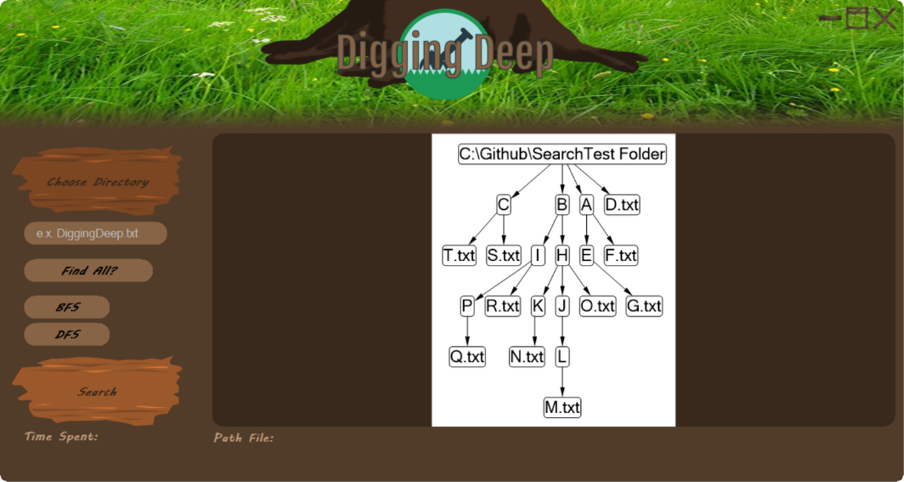
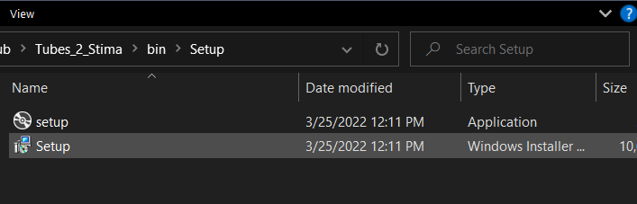
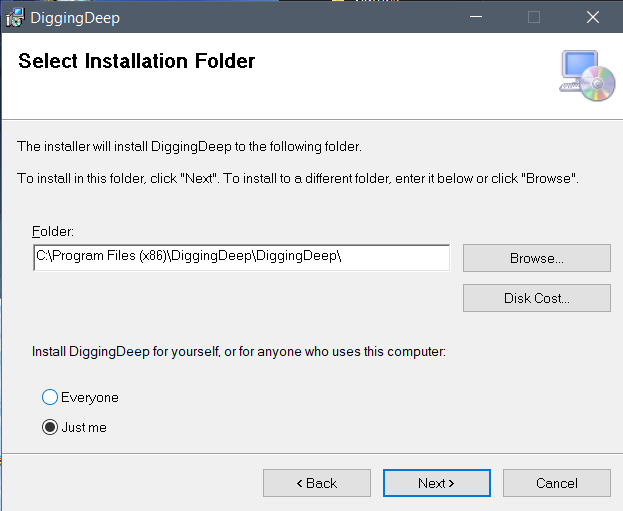
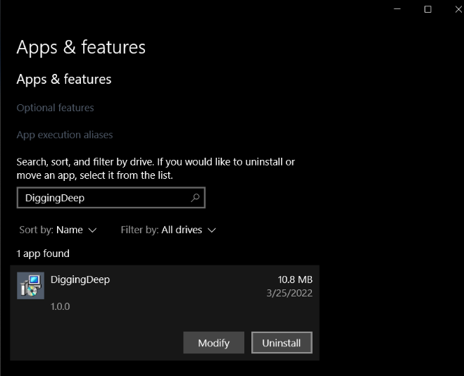

# Tugas Besar IF2211 Strategi Algoritma 2021/2022

Kelompok 08 Digging Deep

- 13520024 / Hilya Fadhilah Imania
- 13520051 / Flavia Beatrix Leoni A. S.
- 13520129 / Nathanael Santoso

## Deskripsi Singkat

Program ini adalah sebuah aplikasi GUI sederhana yang dapat memodelkan fitur
dari file explorer pada sistem operasi, yang disebut juga dengan Folder Crawling.
Dengan memanfaatkan algoritma Breadth First Search (BFS) dan Depth First Search (DFS),
program dapat menelusuri folder-folder yang ada pada direktori untuk mendapatkan
direktori yang diinginkan. Program juga dapat memvisualisasikan hasil dari pencarian
folder tersebut dalam bentuk pohon. Selain pohon, program juga menampilkan list path
dari daun-daun yang bersesuaian dengan hasil pencarian. Path tersebut memiliki hyperlink
menuju folder parent dari file yang dicari, agar file langsung dapat diakses melalui
file explorer.

## Install dan Run

Program diimplementasikan dalam bahasa C# dengan framework .NET dan men-support
sistem operasi Windows.

### Install

Instalasi program ke operating system dapat dilakukan melalui file `setup.exe` atau
`setup.msi` pada direktori `bin/Setup`. Cukup jalankan file tersebut dan ikuti setup
wizard-nya.

### Uninstall

Untuk meng-uninstall, lakukan melalui operating system.

### Menjalankan tanpa install

Cukup jalankan file `bin/Application/DiggingDeep.exe`.
